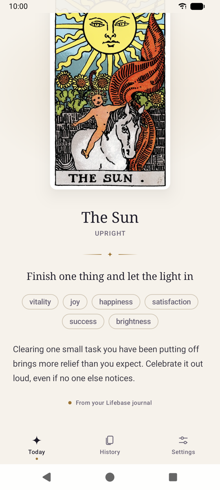
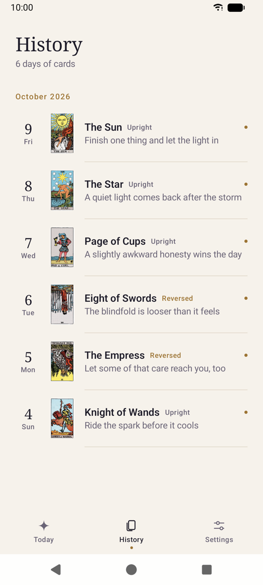
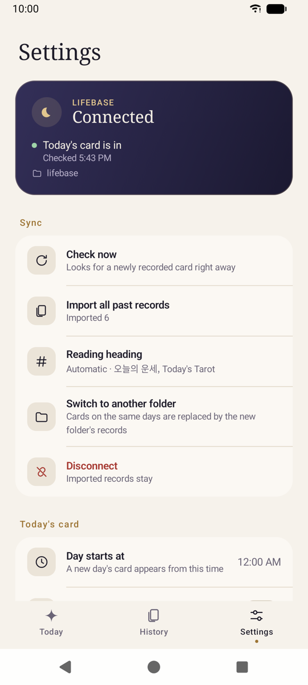
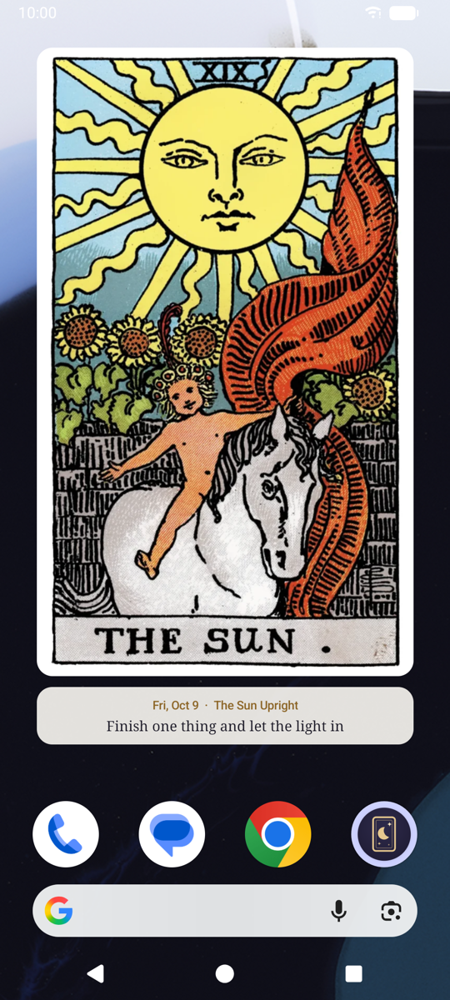

# Daily Tarot

[한국어](README.md)

An Android app that keeps one tarot card and reading for each day.
A home screen widget shows today's card and one line of its reading.

- No server and no account. Readings stay on the device.
- When the day starts, a face-down card waits for you; tap it to draw, or let the app draw at a set time.
- The 78-card Rider–Waite–Smith deck, with 156 upright and reversed readings in English and Korean.
- If you keep a [Lifebase](#lifebase) journal, the card and reading you recorded there appear in the app as written.

## Screens

| Today | History | Settings | Widget |
| --- | --- | --- | --- |
|  |  |  |  |

## Install

Download the APK from [Releases](https://github.com/jagaldol/dailytarot/releases) and install it.
It needs Android 7.0 (API 24) or later, and the first install asks you to allow apps from unknown sources.
If Play Protect warns you, choose "Install anyway".

To build it yourself, see [Build](#build).

## Using the app

### Today's card

Settings → Today's card has two times:

- **Day starts at** (default 12:00 AM): before this time yesterday's card stays up; after it, today's face-down card appears.
- **Draw automatically** (default on) and **Automatic draw time** (default 8:00 AM): if you haven't drawn by then, the app draws for you.

| No card yet today | App | Widget |
| --- | --- | --- |
| Before the day starts | Yesterday's card with "Yesterday's card" | Yesterday's card |
| After the day starts | The face-down card; tap to draw | The card back and "Draw today's card" ("Today's card is drawn at 8:00 AM" while automatic drawing is on). A tap opens the app and draws |
| Connected to Lifebase | The card back and "Today's card isn't in Lifebase yet" | The same message |

A card you haven't seen yet opens only when you tap its back. A card you have seen also turns over once
when you open the app fresh or come back after more than ten minutes.

Without Lifebase you can also **choose a card** from the deck. A day is never drawn twice, and days you
didn't open the app are not filled in later.

### History

The **History** tab lists past cards by month; tap a date to read that day again.
Each record keeps the text it was saved with, so app updates never change past readings.
Delete a record from its detail screen, or everything at once in Settings.

### Widget

Settings → Home screen → **Add widget** opens your launcher's add dialog. You can also touch and hold the
home screen and choose **Widgets → Daily Tarot**. It starts at a full-page size and can shrink to 2×2.

Without a widget, a sheet suggests one right after you turn over today's card (never as the app opens).
It closes only through "Add widget" or "No thanks", asks at most once a day, asks again on the next day's card
while there is still no widget, and stops for good with "Don't ask again". Settings can always add one.

- The card is drawn as large as the cell allows, with the date, card name and one line of the reading in the space left.
- The reading is never cut mid-sentence. Text shrinks a little when space is short, and the card shows alone if it still doesn't fit.
- The widget background is transparent, so only the card floats over your wallpaper.

### Language

The screens and default readings follow the device language: Korean on Korean devices, English otherwise.
On Android 13 or later you can pick the app's language alone in device Settings → Apps → Daily Tarot → Language;
the widget follows. A saved reading keeps the text it was saved with; card names and dates follow the current language.

### Backup

Settings can **export** your records to a JSON file and **restore** them on a new device; restoring fills only
days without a record. Android's automatic backup also includes records and settings (not the Lifebase folder
link, so connect again after restoring).

## Lifebase

[Lifebase](https://lifebaseai.com) is a personal record system built on Obsidian. If your journal holds the
day's tarot card and reading, Daily Tarot reads it and shows it in the app and widget. The app works fully on
its own without it.

1. In Settings → **Choose Lifebase folder**, pick your Lifebase folder (or the `Journal` folder inside it).
   With Syncthing it is usually `Documents/lifebase`. English and Korean Lifebase both work.
2. Once connected, past records are imported once, and today's card comes in automatically after that.

- The folder is only read, and only the dated journal notes are opened. Diary, schedule and notes are never stored.
- On days your journal has a card, the journal's card replaces the one drawn in the app.
- Automatic drawing turns off while connected. Tapping the card back doesn't draw; if you need one,
  **Draw a card yourself** does (and is replaced once your journal has the day's reading).
- While waiting for today's card the app checks about every 15 minutes, then rests until the next day.
  It also checks when you open the app and with Settings → Check now. Android's battery rules can delay scheduled checks.
- Records drawn or chosen in the app can be deleted while connected; imported ones after disconnecting.
- Disconnecting keeps the imported records.

### Note format

```markdown
---
tarot-card: The Empress
tarot-reverse: true
---

## Today's Tarot

> [!quote] [[The Empress]] · Reversed
> **One-line reading**
> Keywords: abundance, care, creativity
>
> Body
```

Only the frontmatter and the reading section of `Journal/YYYY/MM/YYYY-MM-DD.md` are read. Korean notes
(`## 오늘의 운세`, `키워드:`, `정방향`/`역방향`) are read the same way.
Older notes with only keywords are read too, and the default reading is shown alongside them.
If the card or orientation differs between the frontmatter and the callout, that day is left unchanged.

If you renamed the reading heading in your journal, enter it under Settings → **Reading heading** → **Custom**.
The custom heading is looked for first and the defaults (`Today's Tarot`, `오늘의 운세`) still cover notes written
before the rename. Changing it imports past records once more. Lifebase's own sections (Diary, Schedule, To do, Notes) can't be chosen.

## Build

- JDK 21, Android SDK Platform 37.0, Build Tools 36.0.0
- Open the project in Android Studio, or set `sdk.dir` in `local.properties`.

```sh
./gradlew :app:installDebug          # install a debug build on a connected device or emulator
./gradlew :app:assembleRelease       # app/build/outputs/apk/release/
```

Release builds shrink code and resources with R8. Signing details are read from a properties file outside the
repository (the `DAILYTAROT_KEYSTORE_PROPERTIES` environment variable, else
`~/.android/dailytarot/keystore.properties`). Without it the APK is built unsigned.

```properties
storeFile=/path/to/release.jks
storePassword=…
keyAlias=…
keyPassword=…
```

### Tests

```sh
./gradlew :app:testDebugUnitTest :app:lint
./gradlew :app:connectedDebugAndroidTest   # on a test device or emulator
python3 tools/check_assets.py
```

Device tests change app data (today's record, the Lifebase link), so don't run them on a device you use.
The verification log is in [docs/verification.md](docs/verification.md) (Korean).

## Structure

- `model/`: the 78-card deck, the `Day` date type that also works on API 24, and `DailyReading` per date
- `data/`: the SQLite store keyed by date, the single writer that keeps one card per day, the reading catalogs, settings, backup
- `data/lifebase/`: the journal reading parser, Storage Access Framework reads, sync
- `work/`: scheduled WorkManager jobs
- `widget/`: the Glance widget
- `ui/`: Compose screens and theme, dates and times per language (`Labels.kt`)

The only libraries are AndroidX (Compose, Glance, DataStore, WorkManager).

## Tools

- `tools/check_assets.py`: checks the 156 card images and the English and Korean reading catalogs
- `tools/extract_lifebase_catalog.py`: re-extracts or compares a reading catalog from a Lifebase card dictionary (`--locale en` for English)
- `tools/make_launcher_icons.py`: builds launcher icons for Android 7.x
- `tools/fetch_rws_images.sh`, `convert_pngs_to_webp.sh`, `make_thumbs.sh`: prepare card images (needs `cwebp`)

Sources for the card art and readings are in [ASSETS.md](ASSETS.md).

## License

The code is under the [MIT License](LICENSE). The card art (the 1909 Rider–Waite–Smith deck) is in the public domain.
