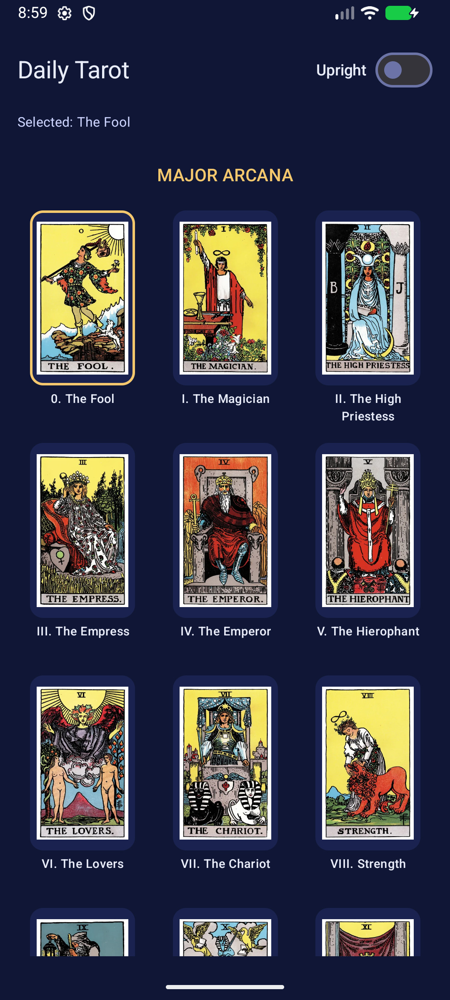
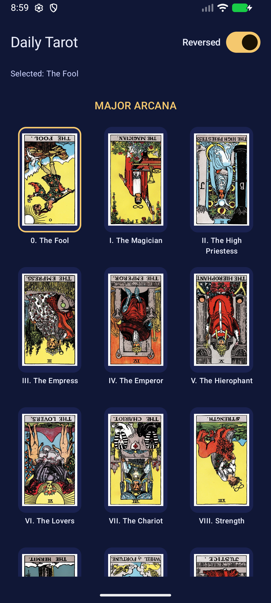

# Daily Tarot

선택한 타로 카드 한 장을 Android 홈 화면 위젯에 표시하는 개인 앱입니다.
Rider–Waite–Smith 덱 78장 중 한 장을 고르고 정방향·역방향을 바꿀 수 있습니다.
선택은 기기에 저장되며, 모든 Daily Tarot 위젯이 같은 카드를 표시합니다.

날짜별 기록이나 자동 추첨 기능은 없습니다. 마지막으로 선택한 카드를 바꾸기 전까지 유지합니다.
네트워크 연결이나 계정이 필요하지 않습니다.

## 화면

| 카드 선택 | 역방향 | 홈 화면 위젯 |
| --- | --- | --- |
|  |  |  |

## 실행

- Android 7.0(API 24) 이상
- JDK 21, Android SDK Platform 37.0, Build Tools 36.0.0
- Android Studio에서 프로젝트를 열어 SDK를 설정하거나, `local.properties`에 `sdk.dir`을 지정합니다.
- Gradle은 저장소의 wrapper를 사용합니다.

```sh
./gradlew :app:assembleDebug
./gradlew :app:installDebug
adb shell am start -n com.jagaldol.dailytarot/.MainActivity
```

앱에서 카드를 선택한 뒤 홈 화면의 위젯 목록에서 Daily Tarot를 추가합니다.
위젯을 누르면 선택 화면이 열립니다. 위젯 갱신은 Android의 작업 스케줄링에 따라 잠시 늦을 수 있습니다.

## 검증

```sh
./gradlew :app:testDebugUnitTest :app:lint :app:assembleRelease
./gradlew :app:connectedDebugAndroidTest  # 연결된 테스트 기기/에뮬레이터 필요
python3 tools/check_assets.py
```

기기 테스트는 카드 선택값을 변경하므로 테스트용 기기에서 실행합니다.
단위 테스트는 연속 입력·저장 실패·읽기 실패·갱신 실패 복구를 검증합니다.
기기 테스트는 선택/회전 유지, 덱 스크롤, 이미지 로딩, 신규 위젯 및 여러 위젯의 갱신을 검증합니다.
GitHub Actions는 빌드·단위 테스트·린트·이미지 검사를 수행합니다. 기기 테스트는 별도로 실행합니다.

릴리스 빌드에는 R8 코드 및 리소스 축소를 적용합니다. 서명 키는 저장소에 없으며,
`app-release-unsigned.apk`는 배포 전에 별도로 서명해야 합니다.

## 구조

- `ui/TodayScreen.kt`: 카드별 lazy grid와 정·역방향 애니메이션
- `model/`: 78장 덱, 컴파일 시 확인되는 이미지 참조, 선택 모델
- `data/TarotStore.kt`: 기존 `tarot_prefs` DataStore 형식을 유지하는 단일 저장소
- `data/TarotRepository.kt`: 화면 수명과 독립적인 순차 저장, 최신 입력 반영, 오류·재시도 상태
- `data/CardImages.kt`: 비동기 이미지 로딩, 용량 제한 캐시, 위젯용 축소·회전
- `widget/`: 공통 DataStore를 읽는 Glance 위젯과 WorkManager 갱신 작업

위젯별로 카드 데이터를 복제하지 않습니다. 새 위젯도 저장된 선택을 바로 읽습니다.
화면의 회전 애니메이션은 `graphicsLayer`에서 각도를 읽어 프레임마다 목록을 재구성하지 않습니다.
썸네일 캐시는 12MiB, 위젯 비트맵 캐시는 6MiB로 제한합니다. 화면이 사용 중인 이미지는
캐시에서 빠져도 즉시 해제되지 않으므로 이 값은 앱 전체 메모리 상한이 아닙니다.

## 이미지 도구

`tools/fetch_rws_images.sh`는 원본을 가져오며, 기존 PNG/WebP는 건너뜁니다.
`tools/convert_pngs_to_webp.sh`는 PNG를 폭 720px WebP로 변환하고 PNG를 제거합니다.
`tools/make_thumbs.sh`는 원본에서 폭 360px 썸네일을 만들고 기존 썸네일은 유지합니다.
변환에는 `cwebp`가 필요합니다(macOS: `brew install webp`).
기존 썸네일을 새 원본으로 다시 만들려면 해당 썸네일을 먼저 별도로 백업한 후 제거해야 합니다.

이미지 출처와 공개 전 남은 확인 사항은 [ASSETS.md](ASSETS.md)를 참고하세요.
성능 측정과 검증 내역은 [docs/verification.md](docs/verification.md)에 기록합니다.

## 개발 이력과 공개 상태

2025년 8월 Codex CLI로 첫 버전을 만들었습니다. `draft` 브랜치의 테마 변경은 보류된 실험이며
현재 구현에 포함하지 않았습니다. 현재 앱은 기존의 어두운 테마를 사용합니다.

코드의 공개 라이선스는 아직 지정하지 않았습니다. 저장소 공개 전 코드 라이선스를 결정하고,
이미지 재배포 조건과 Git 이력의 민감정보를 확인해야 합니다.
