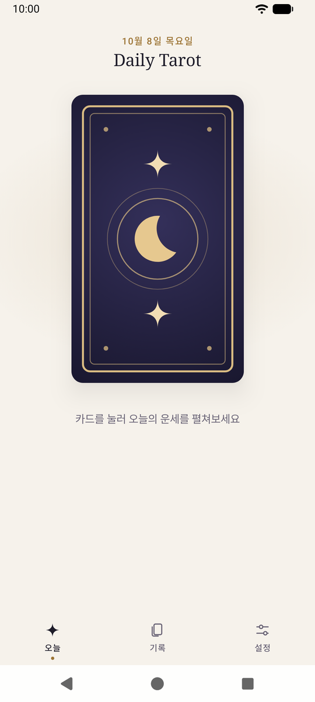
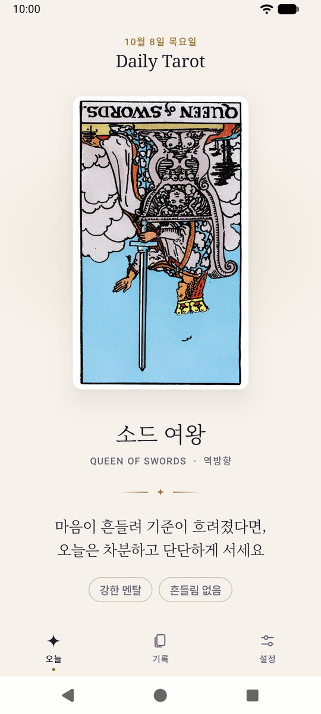
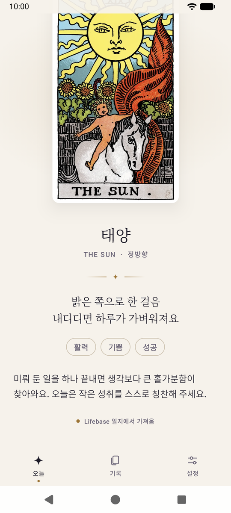
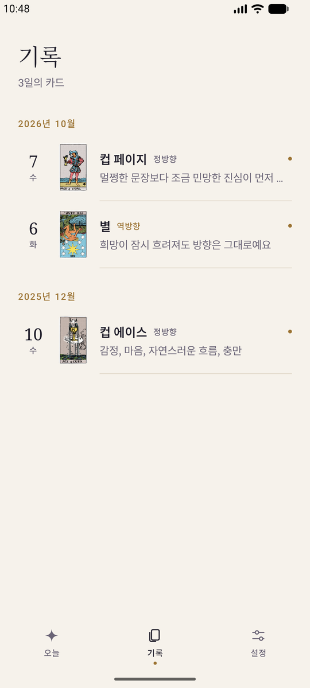
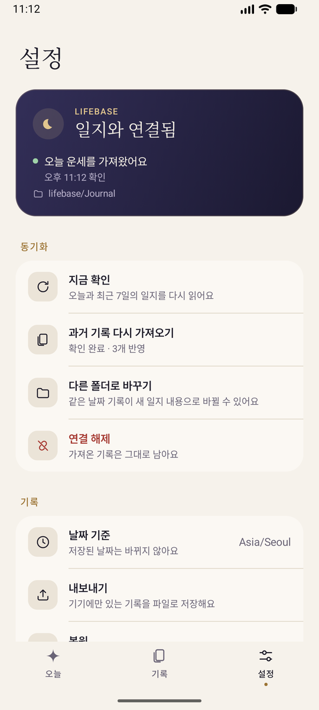
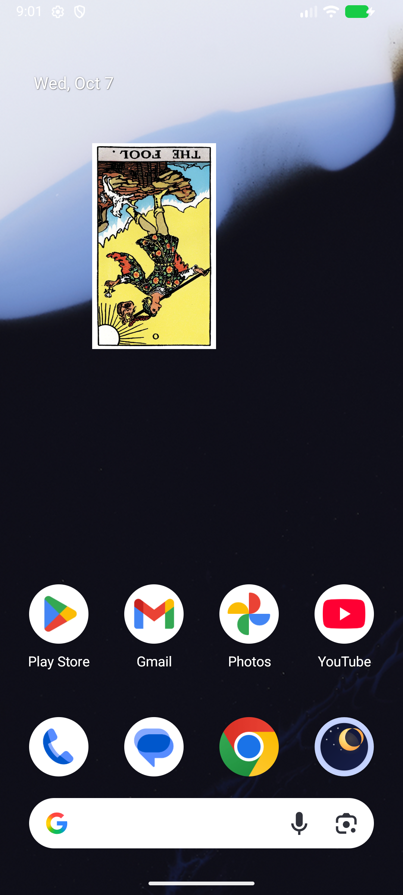
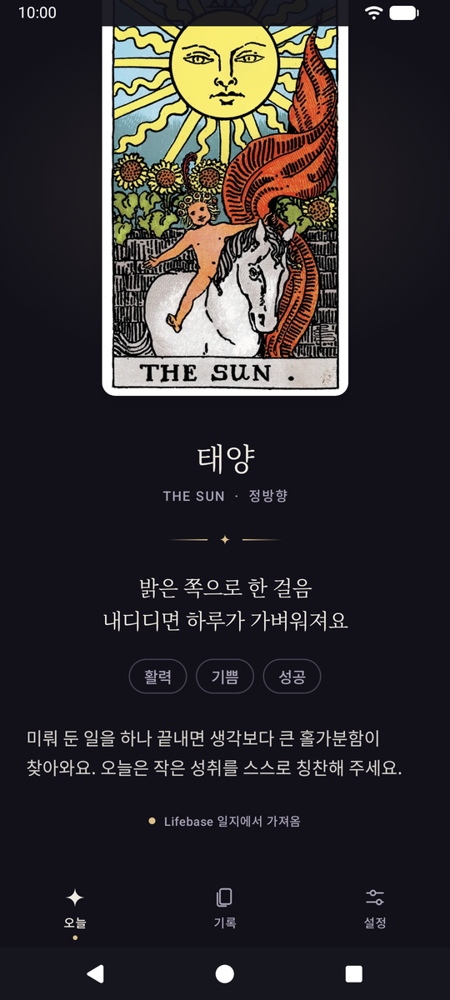
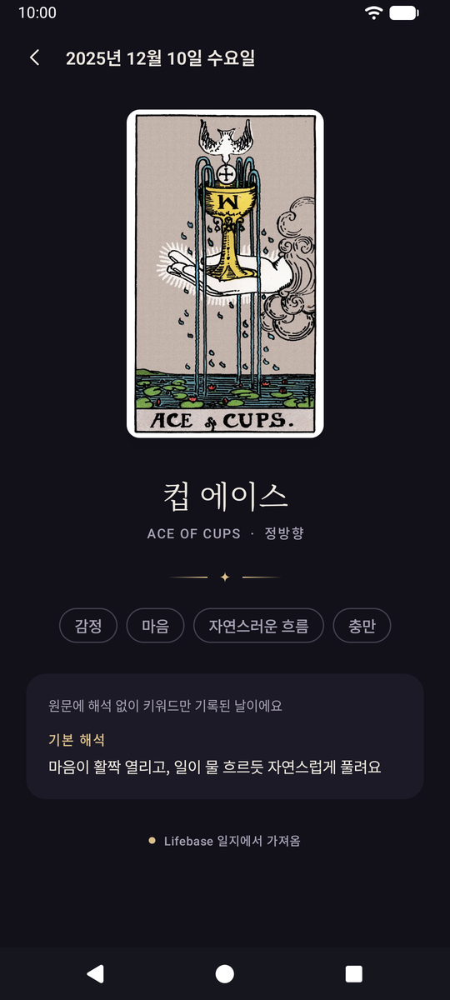

# Daily Tarot

하루에 한 장, 타로 카드와 운세를 날짜별로 남기는 Android 앱입니다.
홈 화면 위젯이 오늘의 카드와 운세 한 줄을 보여줍니다.

- 서버도 계정도 없습니다. 기록은 기기 안에만 저장됩니다.
- 하루가 시작되면 카드 뒷면이 놓이고, 눌러서 뽑거나 정한 시간에 자동으로 뽑습니다.
- 78장 Rider–Waite–Smith 덱과 정·역방향별 한국어 운세 156개가 들어 있습니다.
- [Lifebase](#lifebase-연결) 일지를 쓰고 있다면, 일지에 기록한 카드와 운세를 그대로 가져와 보여줄 수 있습니다.

## 화면

| 오늘 | 운세 | Lifebase 운세 |
| --- | --- | --- |
|  |  |  |

| 기록 | 설정 | 위젯 |
| --- | --- | --- |
|  |  |  |

| 다크 모드 | 해석 없이 키워드만 있는 기록 |
| --- | --- |
|  |  |

## 설치

[Releases](https://github.com/jagaldol/dailytarot/releases)의 APK를 내려받아 설치합니다.
Android 7.0(API 24) 이상이 필요하며, 처음 설치할 때 "출처를 알 수 없는 앱" 설치를 허용해야 합니다.
Play 프로텍트가 경고하면 "무시하고 설치"를 고릅니다.

직접 빌드하려면 아래 [빌드](#빌드)를 참고하세요.

## 사용법

### 오늘의 카드

설정 → 오늘의 카드에서 두 가지 시간을 정합니다.

- **하루 시작 시간**(기본 오전 12:00): 이 시간 전에는 어제 카드를 그대로 보여주고, 지나면 오늘의 카드 뒷면이 놓입니다.
- **자동으로 뽑기**(기본 켜짐)와 **자동으로 뽑는 시간**(기본 오전 8:00): 그때까지 뽑지 않았으면 앱이 대신 뽑습니다.

| 오늘 카드가 없을 때 | 앱 | 위젯 |
| --- | --- | --- |
| 하루 시작 전 | 어제 카드와 "어제의 카드" 안내 | 어제 카드 |
| 하루 시작 후 | 카드 뒷면, 누르면 뽑힘 | 카드 뒷면과 "오늘의 카드를 뽑아주세요". 누르면 앱이 열리며 바로 뽑힘 |
| Lifebase 연결 중 | 카드 뒷면과 "Lifebase에 오늘의 카드가 아직 등록되지 않았어요" | 같은 안내 |

처음 보는 카드는 뒷면을 눌러야 펼쳐집니다. 이미 본 카드도 앱을 새로 열거나 10분 넘게 다른 곳에 있다가 돌아오면
뒷면에서 한 번 뒤집히며 나타납니다.

카드 목록에서 **직접 고르기**도 할 수 있습니다. 같은 날에는 다시 뽑지 않으며, 앱을 열지 않은 날을 나중에 채우지도 않습니다.

### 기록

**기록** 탭에서 지난 카드를 월별로 보고, 날짜를 눌러 그날의 운세를 다시 읽을 수 있습니다.
기록에는 저장할 때의 문구가 그대로 남아서, 나중에 앱이 업데이트되어도 지난 운세가 바뀌지 않습니다.
기록 상세의 휴지통이나 설정의 전체 지우기로 기록을 지울 수 있습니다.

### 위젯

설정 → 홈 화면 → **위젯 추가하기**를 누르면 런처의 추가 화면이 열립니다. 홈 화면을 길게 누르고
**위젯 → 데일리 타로**를 골라도 됩니다. 처음에는 한 화면을 채우는 크기로 놓이고, 2×2까지 줄일 수 있습니다.

위젯이 없으면 오늘의 카드를 펼친 직후 아래에서 위젯을 권하는 창이 올라옵니다(앱을 켜자마자 띄우지는 않습니다).
"위젯 추가하기"나 "괜찮아요" 중 하나를 골라야 닫히며, 하루에 한 번만 묻습니다. 위젯이 없으면 다음 날 카드에서 다시 묻고,
"다시 보지 않기"를 체크하면 더 묻지 않습니다. 설정에서는 언제든 추가할 수 있습니다.

- 카드를 칸에 맞춰 최대한 크게 그리고, 남는 자리에 날짜·카드 이름과 운세 한 줄을 붙입니다.
- 운세를 중간에서 자르지 않습니다. 자리가 모자라면 글자를 조금씩 줄이고, 그래도 안 되면 카드만 보여줍니다.
- 위젯 배경은 투명해서 배경화면 위에 카드만 떠 있습니다.

### 백업

설정에서 기록을 JSON 파일로 **내보내고**, 새 기기에서 **복원**할 수 있습니다. 복원은 기록이 없는 날만 채웁니다.
Android 자동 백업에도 기록과 설정이 포함됩니다(Lifebase 폴더 연결은 제외되므로 복원 후 다시 연결합니다).

## Lifebase 연결

[Lifebase](https://lifebaseai.com)는 Obsidian 기반 개인 기록 시스템입니다. 일지에 그날의 타로 카드와 운세를 적어 두었다면,
Daily Tarot이 그 내용을 읽어 앱과 위젯에 보여줍니다. 연결하지 않아도 앱은 혼자서 모두 동작합니다.

1. 설정 → **Lifebase 폴더 선택**에서 Lifebase 폴더(또는 그 안의 `Journal` 폴더)를 고릅니다.
   Syncthing으로 동기화한다면 보통 `Documents/lifebase`입니다.
2. 연결하면 지난 기록을 한 번 모두 불러오고, 이후에는 오늘의 카드를 자동으로 가져옵니다.

- 폴더는 읽기만 하며, 날짜별 일지 파일 외에는 열지 않습니다. 일지의 일기·일정·메모는 저장하지 않습니다.
- 일지에 카드가 있는 날은 앱에서 뽑은 카드 대신 일지의 카드를 씁니다.
- 연결 중에는 자동으로 뽑기가 꺼집니다. 카드 뒷면을 눌러도 뽑히지 않으며, 꼭 필요하면 **카드 직접 뽑아보기**로 뽑을 수 있습니다
  (이 카드도 나중에 일지 기록이 들어오면 바뀝니다).
- 오늘의 카드를 기다리는 동안에만 약 15분마다 확인하고, 가져온 뒤에는 다음 날까지 쉽니다.
  앱을 열 때와 설정 → 지금 확인을 누를 때도 확인합니다. Android 절전 정책 때문에 예약 확인은 늦어질 수 있습니다.
- 연결 중에도 앱에서 뽑거나 고른 기록은 지울 수 있습니다. 일지에서 불러온 기록은 연결을 해제한 뒤에 지울 수 있습니다.
- 연결을 해제해도 불러온 기록은 남습니다.

### 읽는 형식

```markdown
---
tarot-card: Page of Cups
tarot-reverse: false
---

## 오늘의 운세

> [!quote] [[Page of Cups|컵 페이지 (Page of Cups)]] · 정방향
> **한 줄 운세**
> 키워드: 감수성, 새 마음, 공상
>
> 본문
```

`Journal/YYYY/MM/YYYY-MM-DD.md`의 frontmatter와 `## 오늘의 운세` 섹션만 읽습니다.
한 줄·본문 없이 키워드만 있는 기록도 읽으며, 이때는 기본 해석을 따로 함께 보여줍니다.
카드나 방향이 frontmatter와 본문에서 서로 다르면 그날 기록을 바꾸지 않습니다.

## 빌드

- JDK 21, Android SDK Platform 37.0, Build Tools 36.0.0
- Android Studio에서 프로젝트를 열거나, `local.properties`에 `sdk.dir`을 지정합니다.

```sh
./gradlew :app:installDebug          # 연결된 기기·에뮬레이터에 디버그 빌드 설치
./gradlew :app:assembleRelease       # app/build/outputs/apk/release/
```

릴리스 빌드는 R8로 코드와 리소스를 줄입니다. 서명 정보는 저장소 밖의 properties 파일에서 읽습니다
(`DAILYTAROT_KEYSTORE_PROPERTIES` 환경 변수, 없으면 `~/.android/dailytarot/keystore.properties`).
파일이 없으면 서명하지 않은 APK를 만듭니다.

```properties
storeFile=/path/to/release.jks
storePassword=…
keyAlias=…
keyPassword=…
```

### 테스트

```sh
./gradlew :app:testDebugUnitTest :app:lint
./gradlew :app:connectedDebugAndroidTest   # 테스트용 기기·에뮬레이터에서 실행
python3 tools/check_assets.py
```

기기 테스트는 앱 데이터(오늘 기록, Lifebase 연결)를 바꾸므로 평소 쓰는 기기에서는 실행하지 마세요.
검증 기록은 [docs/verification.md](docs/verification.md)에 있습니다.

## 구조

- `model/`: 78장 덱, API 24에서도 쓰는 날짜 타입 `Day`, 날짜별 기록 `DailyReading`
- `data/`: 날짜를 기본키로 하는 SQLite 저장소, 하루 한 장 규칙을 지키는 단일 writer, 운세 카탈로그, 설정, 백업
- `data/lifebase/`: 일지 운세 파서, Storage Access Framework 읽기, 동기화
- `work/`: WorkManager 예약 작업
- `widget/`: Glance 위젯
- `ui/`: Compose 화면과 테마

외부 라이브러리는 AndroidX(Compose, Glance, DataStore, WorkManager)만 씁니다.

## 도구

- `tools/check_assets.py`: 카드 이미지 156개와 운세 카탈로그 검사
- `tools/extract_lifebase_catalog.py`: Lifebase 카드 사전에서 운세 카탈로그를 다시 추출하거나 비교
- `tools/make_launcher_icons.py`: Android 7.x용 런처 아이콘 생성
- `tools/fetch_rws_images.sh`, `convert_pngs_to_webp.sh`, `make_thumbs.sh`: 카드 이미지 준비(`cwebp` 필요)

카드 그림과 운세 문구의 출처는 [ASSETS.md](ASSETS.md)에 있습니다.

## 라이선스

코드는 [MIT 라이선스](LICENSE)를 따릅니다. 카드 그림(1909년 Rider–Waite–Smith 덱)은 퍼블릭 도메인입니다.
